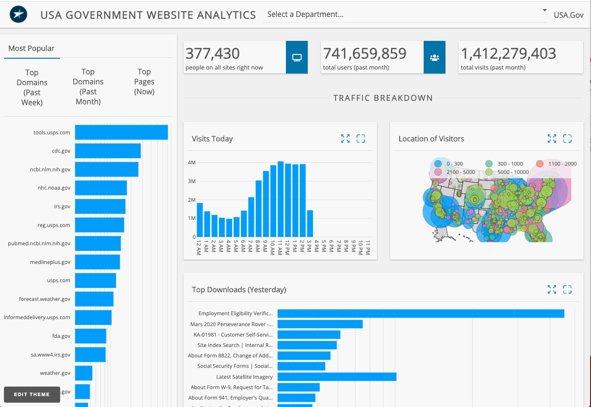

# USA Gov Analytics

This dashboard provides users with an interactive view into publicly available US government data
View this app on [Dash Deployment Server](https://dash-gallery.plotly.com).

## Requirements

- python 3

## Local installation

```shell
cd dash-usa-govt-analytics
virtualenv ~/.virtualenvs/usa-gov-analytics
source ~/.virtualenvs/usa-gov-analytics/bin/activate
pip install -r requirements.txt

python app.py 
```

## Features

- Dash Design Kit

### Demo Functionality

This app allows the user to filter though the data set based on different departments within the US Gov. The initial selection is ALL. 

To use this app:

* Select department from the header 
* Get more granular data from the tabs on the left-most chart
* Heavy use of modal and full screen charts

## Screenshots



## Errata

Data is refreshed on page load and is coming from https://analytics.usa.gov/data/

## Demo Issues

N/A


